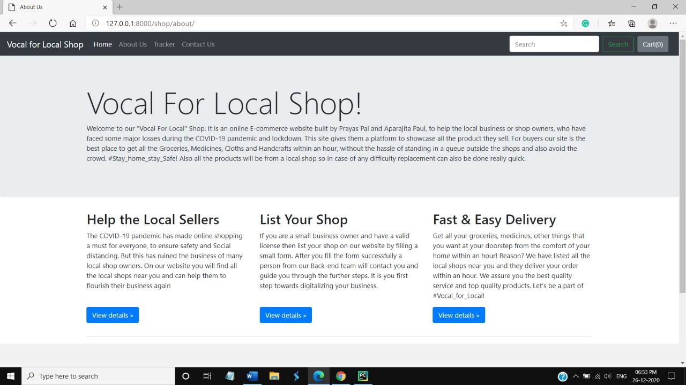
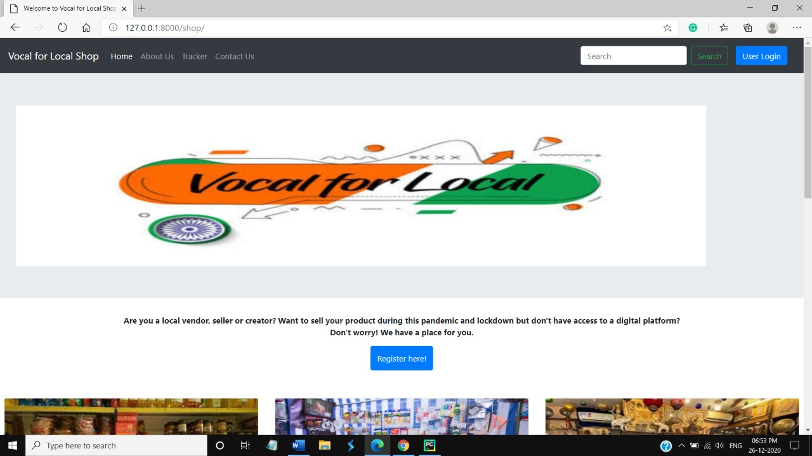
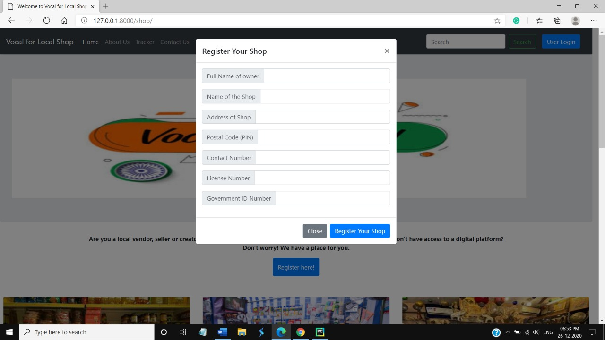
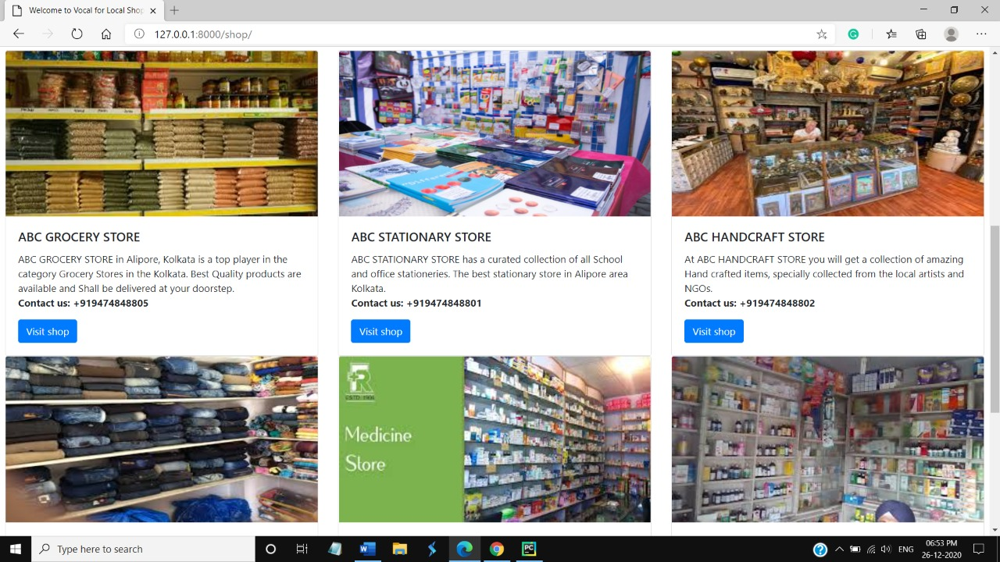
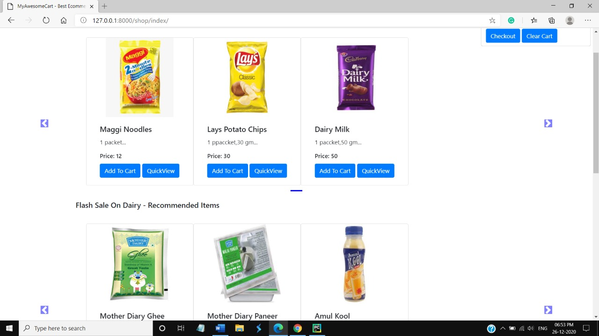
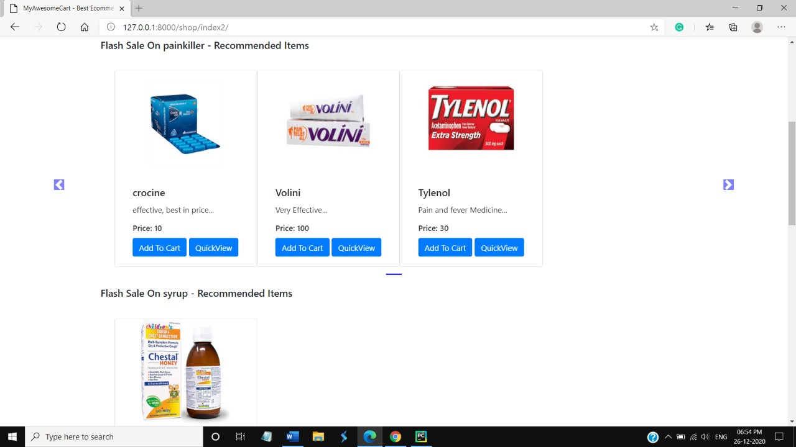

# Vocal for local Shop
A website where local vendors and creators take their first leap towards digitalizing their business. 

## Overview
We are presenting our solution for HackX. 
Keeping the theme “Supporting services for the new normal”, we have built a very interactive and user-friendly website “Vocal for Local”.
Due to the pandemic of COVID-19 and the worldwide Lockdown everyone stayed at home to break the chain, local shops which are not listed on the global E-Commerce Sites faced a huge loss. Online shopping became a #New_Normal but sometimes the deliveries get really delayed at a lot of places and similarly replacement becomes a hassle. We have tried building this website especially for small businesses, local artists and local shops, promoting #Vocal_For_Local. So that deliveries can be really fast, replacements and return can be easier and every service can be availed while sitting at home, avoiding the crowd and long queue. #Stay_Home_Stay_Safe! 

## Features
* Our website gives the local shop owners a digital platform where they can list their products for sale.
* The Shop owners can easily register their shops with our website and list all their products without any hassle or any paper work, every detail will be collected using a form into our Data Base.
* When Buyers will visit the Website, they can easily enter their PIN code and nearby local shops will appear on the screen and then they can visit the specific shop they want and add things in their cart.

## Technology Stack
### Web Technology
- Frontend: 
  -	HTML 
  -	CSS 
  -	JavaScript
- Backend
  -	 Django (Python3)
  -	SQLite3 (Data Base)
- Tools:
  -	PyCharm
  -	Git
  
  
## Setup
### 1. Pre-requisites:
1. Python 3
2. pip 3
3. Django (Any version will work)
### 2. Clone this Repo :
```sh
git clone https://github.com/Tuntai/project.git
cd .\vocal for local
```
You can also download the folder and extract all the files in your local system. Open the terminal in the directory and follow the below steps.
### 3. Apply migrations : 
```sh
python manage.py makemigrations
python manage.py migrate
```
### 4. Run server:
```sh
python manage.py runserver
```
That's it! Copy the development server address from the terminal paste in the browser (any browser will work) and nevigate through our website and promote #Vocal_For_Local where ever and when ever possible! 

## Screen Shots








## Our Team
Team_Spectre : 
* Prayas Pal
* Aparajita Paul 

